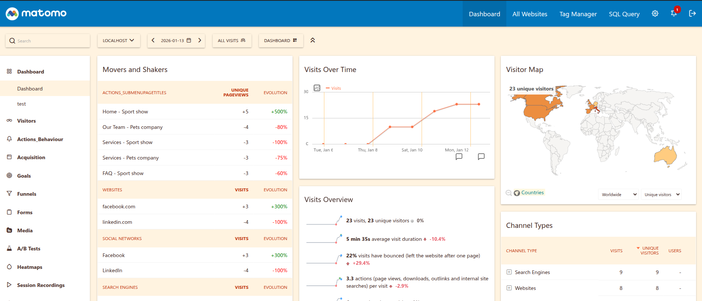

# ThemeSummer

## Description

A warm and vibrant summer theme for Matomo with coral oranges, deep sky blues, and sunny accents. Evokes sunshine and ocean.

This theme transforms your Matomo dashboard with a warm, sun-kissed color palette featuring:

- Sandy warm backgrounds and deep earth text tones
- Deep sky blue header with coral orange accents
- Custom graph color series in corals, ocean blues, tropical teals, and sunshine yellows
- Visitor map styled with warm amber gradients and cyan highlights

## Installation

Install it via Matomo Marketplace or manually:

1. Download the plugin
2. Extract the files into the `plugins/ThemeSummer` directory
3. Activate the theme in **Administration > Platform > Themes**

## License

GPL-3.0+
